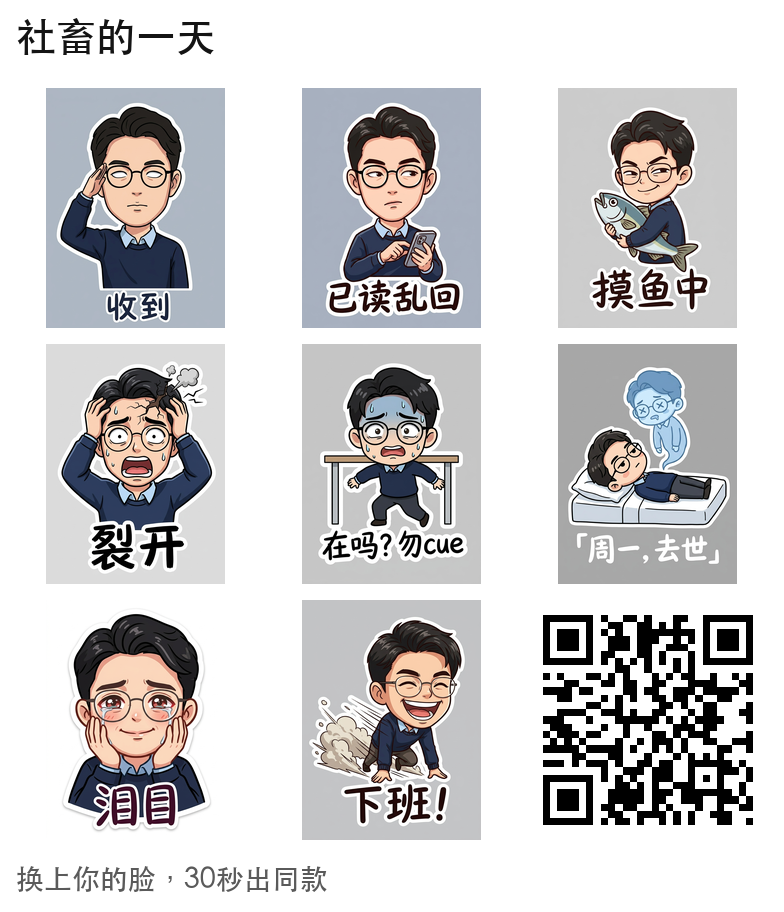

# 表情包工厂 biaoqingbao

**一张自拍，变成一整套微信表情包。** 16 个梗共享同一个你，静态 + 动图，直接满足微信导入规格。

*Turn one selfie into a full WeChat sticker pack — 16 memes, one coherent cartoon you, static + animated, WeChat-spec ready.*

<p align="center">
  
  
</p>

> 上面这套的"本人"并不存在——是 AI 生成的演示脸。换成你的自拍，就是你的脸。

## 为什么做这个

用 AI 给自己做表情包不难，难的是后面那 4 个小时：抠图、240×240 规格化、GIF 压到 500KB、一张一张导入。而且生成 16 张"随机像你的图"容易，让 16 张是**同一个角色、同一种画风、讲同一套梗**很难。

biaoqingbao 把这条流水线全自动化：**梗剧本（YAML）→ 批量一致性生成 → 微信规格后处理 → 九宫格晒图卡**。

## 5 分钟跑通

```bash
git clone https://github.com/alextangson/biaoqingbao && cd biaoqingbao
uv sync --extra web

export GEMINI_API_KEY=你的key
# 中国大陆直连不了 Gemini，配一个中转端点即可：
export BIAOQINGBAO_GEMINI_BASE_URL=https://你的中转站/gemini

uv run biaoqingbao web        # 打开 http://127.0.0.1:8000
```

网页上传自拍 → 选梗剧本 → 逐张揭晓。也有纯 CLI：

```bash
uv run biaoqingbao generate selfie.jpg --pack packs/shechu.yaml --out out/
uv run biaoqingbao retry selfie.jpg 4 --pack packs/shechu.yaml --out out/   # 单张重摇
```

## 功能

- **6 套梗剧本**：社畜的一天、阴阳大师、恋爱脑、干饭人、期末战神、哈基米——每套 16 个梗，按真实聊天语境策展
- **人设一致性**：同一参考照片 + 同一风格块注入每张 prompt，16 张是同一个角色
- **三档动图**：⚡ 抖一抖（免费秒出）/ 🎞 拼帧（一次图像编辑，经典逐帧味）/ 🎬 视频（Seedance 图生视频，大动作专用）
- **微信规格全包**：240×240、透明 PNG + 单帧 GIF 双格式、动图 ≤500KB 自动降档压缩
- **重摇改字**：崩脸单张重抽，文案随手改成你想要的
- **历史记录**：生成过的套装重启后还在；你的自拍永远只在内存里，不落盘
- **手机直达**：桌面页面出二维码，手机扫码打开，长按保存进微信

## 模型可插拔

| Provider | 用途 | 配置 |
|---|---|---|
| Gemini（默认） | 静态生成 | `GEMINI_API_KEY`（大陆需中转：`BIAOQINGBAO_GEMINI_BASE_URL`） |
| 即梦 Seedream | 静态生成 | `ARK_API_KEY`，默认 4.0@1K（省钱），`BIAOQINGBAO_SEEDREAM_MODEL` 可换 |
| 即梦 Seedance | 视频动图 | `ARK_API_KEY`，按秒计费，注意成本 |

**License 干净承诺**：本项目 Apache-2.0，默认路径零非商用依赖（不碰 InsightFace 这类仅限研究的组件），任何人都可以放心 fork 和商用。

## 投稿你的梗剧本

梗库是这个项目真正的核心资产。一套剧本就是一个 YAML 文件——16 个梗的文案、表情、动作、镜头，外加一个全局风格块。写法见 [packs/CONTRIBUTING.md](packs/CONTRIBUTING.md)，校验只需：

```bash
uv run biaoqingbao validate packs/你的剧本.yaml
```

欢迎 PR：新梗、新套装、节令限定（春节版、高考季……）。

## 隐私与合规

- 自拍只存在进程内存，生成完即弃，重启即无；历史记录只含产物不含原图
- 走云 API 意味着照片会发送给你配置的模型服务商——介意请等本地模型支持（路线图上，Qwen-Image，Apache 2.0）
- AI 生成内容请遵守当地法规，合集晒图卡带"AI 生成"标识

## 路线图

- [x] 剧本编译器 + 一致性生成 + 微信规格流水线
- [x] 本地 Web UI（逐张揭晓 / 重摇改字 / 三档动图 / 历史）
- [ ] 托管网站 + remix 页（"换上你的脸，30 秒出同款"）
- [ ] 本地模型支持（Qwen-Image / ComfyUI 后端）——"你的脸不出电脑"
- [ ] 自动崩脸检测与重试

## License

[Apache-2.0](LICENSE)
